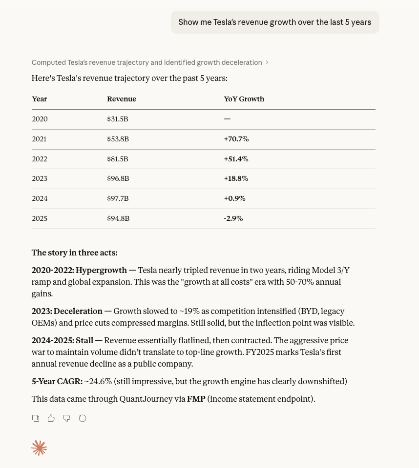
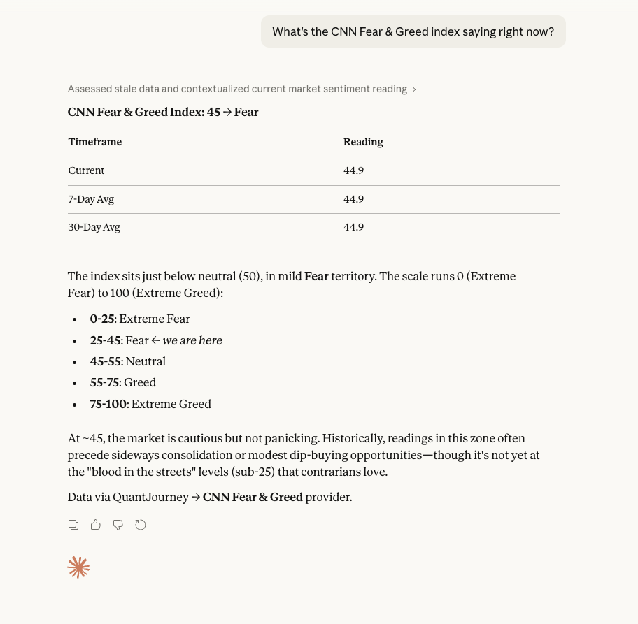

# Examples — QuantJourney MCP in Claude Desktop

Real responses from Claude Desktop using the QuantJourney MCP Server.

---

## Fundamentals: P/E Ratio Comparison

> **Prompt**: *"Compare P/E ratios for AAPL, MSFT, and GOOGL"*

Claude fetches real-time valuation metrics from FMP and presents a side-by-side comparison with key observations.

  

---

## Fundamentals: Tesla Revenue Growth

> **Prompt**: *"Show me Tesla's revenue growth over the last 5 years"*

Claude retrieves income statement data from FMP, calculates YoY growth rates, and identifies the growth deceleration narrative.

  

---

## Macro: GDP Growth vs Unemployment

> **Prompt**: *"Plot US GDP growth vs unemployment rate from FRED"*

Claude pulls two FRED series, generates an interactive chart, and annotates key economic events (2008 crisis, COVID shock, 2021 rebound).

  

---

## Sentiment: CNN Fear & Greed Index

> **Prompt**: *"What's the CNN Fear & Greed index saying right now?"*

Claude fetches the current reading from the CNN Fear & Greed provider and contextualizes the signal with historical interpretation.

  

---

## Crypto: BTC/USDT Orderbook Depth

> **Prompt**: *"What's the current BTC/USDT orderbook depth?"*

Claude accesses live Binance orderbook data via CCXT, showing top-of-book levels, bid/ask spread, and depth summary.

  

