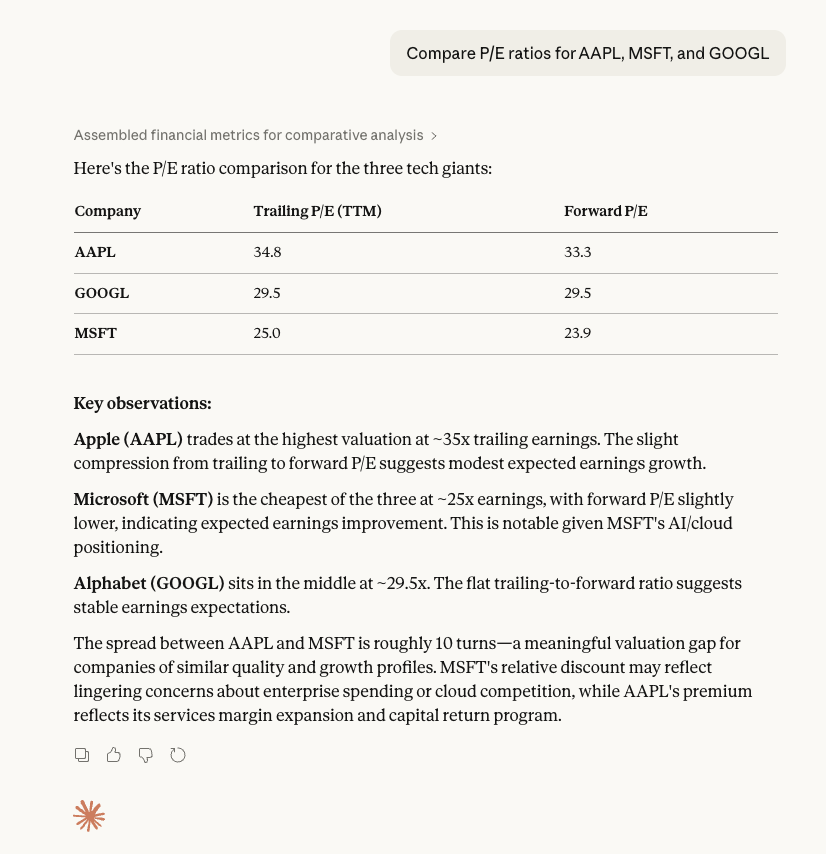
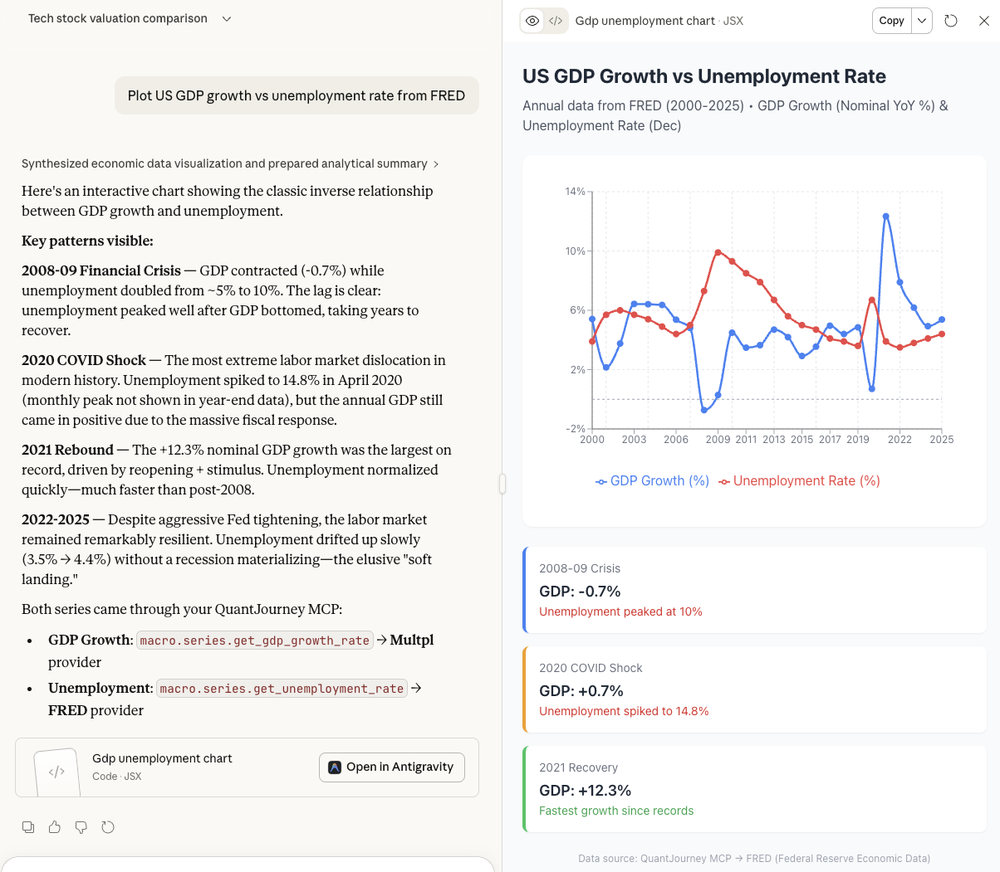

# QuantJourney MCP Server

Connect AI assistants (Claude Desktop, Cursor, Windsurf) to **500+ financial data tools** from QuantJourney using the [Model Context Protocol (MCP)](https://modelcontextprotocol.io).

## Features

- **500+ Financial Tools** — stocks, crypto, forex, commodities, fundamentals, macro
- **16+ Data Providers** — FMP, FRED, Yahoo Finance, EOD, SEC, CCXT, and more
- **Automatic Token Refresh** — sessions stay alive without restarting
- **API Key & Email Auth** — use whichever suits your workflow
- **Zero Configuration** — `.env` file support, works out of the box

## Quick Start

### 1. Prerequisites

- Python 3.10+
- QuantJourney account → [Sign up](https://users.quantjourney.cloud)

### 2. Install

```bash
git clone https://github.com/QuantJourneyOrg/mcp-server.git
cd mcp-server
pip install .
```

Or with requirements only:

```bash
pip install -r requirements.txt
```

### 3. Create `.env` File

```env
QJ_MCP_EMAIL=your@email.com
QJ_MCP_PASSWORD=your-password
```

Or use an API key instead:

```env
QJ_MCP_API_KEY=QJ_live_xxxxxxxxxxxxxxxx
```

### 4. Configure Claude Desktop

Edit `~/Library/Application Support/Claude/claude_desktop_config.json` (Mac) or `%APPDATA%\Claude\claude_desktop_config.json` (Windows):

```json
{
  "mcpServers": {
    "quantjourney": {
      "command": "python",
      "args": ["/absolute/path/to/mcp-server/server.py"],
      "env": {
        "QJ_MCP_EMAIL": "your@email.com",
        "QJ_MCP_PASSWORD": "your-password"
      }
    }
  }
}
```

> **Tip**: If you created a `.env` file, you can omit the `env` block entirely.

### 5. Restart Claude Desktop

Restart Claude and look for the MCP tools icon (🔧). Start asking financial questions!

## Configuration

| Environment Variable | Description | Required |
|---------------------|-------------|----------|
| `QJ_MCP_EMAIL` | Your QuantJourney email | Yes* |
| `QJ_MCP_PASSWORD` | Your QuantJourney password | Yes* |
| `QJ_MCP_API_KEY` | API key (alternative to email/password) | Yes* |
| `QJ_MCP_BEARER` | Raw JWT token (advanced) | No |
| `QJ_MCP_BASE_URL` | API URL (default: `https://api.quantjourney.cloud`) | No |

\* Either email/password **or** API key is required.

## Example Prompts

Once configured, try these in Claude:

**Fundamentals & Valuation**
- *"Compare P/E ratios for AAPL, MSFT, and GOOGL"*
- *"Show me Tesla's revenue growth over the last 5 years"*
- *"Get Apple's latest balance sheet and calculate debt-to-equity"*

**Market Data**
- *"What are the top 10 S&P 500 performers this quarter?"*
- *"Show me the EURUSD exchange rate history for the past month"*
- *"Get the current options chain for NVDA"*

**Macro & Economics**
- *"Plot US GDP growth vs unemployment rate from FRED"*
- *"What's the latest CPI and inflation data?"*
- *"Compare interest rates across G7 countries from OECD"*

**Sentiment & Alternative**
- *"What's the CNN Fear & Greed index saying right now?"*
- *"Show me recent insider trading activity for META"*
- *"Get the latest 13F filings for Berkshire Hathaway from SEC"*

**Crypto**
- *"Compare Bitcoin and Ethereum performance this year"*
- *"What's the current BTC/USDT orderbook depth?"*

### See It in Action

<p align="center">
  
  
</p>

> 📸 More examples with screenshots → [EXAMPLES.md](EXAMPLES.md)

## Data Providers

| Provider | Tools | Description |
|----------|-------|-------------|
| FMP | 81 | Financial Modeling Prep — fundamentals, statements |
| FRED | 80 | Federal Reserve Economic Data |
| Yahoo Finance | 73 | Real-time quotes, historical data |
| EOD | 61 | EOD Historical Data |
| MULTPL | 38 | Market multiples and valuations |
| CNN | 32 | Fear & Greed Index, sentiment |
| SEC | 22 | SEC EDGAR filings |
| CCXT | 21 | Crypto exchange data |

## Troubleshooting

### "No tools loaded"
- Verify credentials in `.env` or Claude config
- Check you have an active QuantJourney subscription
- Look at stderr output for authentication errors

### "Token expired" / tools stop working
- This should auto-resolve with v1.1.0's token refresh
- If persisting, restart Claude Desktop

### Tools not appearing in Claude
- Restart Claude Desktop completely
- Verify the Python path in config is correct
- Check `python server.py` runs without errors from terminal

## License

MIT License — see [LICENSE](LICENSE)

## Links

- [QuantJourney API](https://api.quantjourney.cloud)
- [MCP Documentation](https://api.quantjourney.cloud/mcp)
- [Sign Up](https://users.quantjourney.cloud)
- [Discord](https://discord.gg/Qkvktf7fRv)
- [Changelog](CHANGELOG.md)
